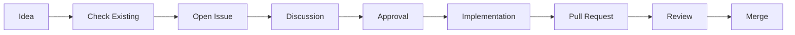

# Community Guidelines & Tools

Welcome to the Nixite community! This guide covers community features, contribution tools, and collaboration practices.

## 📋 Table of Contents

- [Community Features](#community-features)
- [Contributing](#contributing)
- [Package Requests](#package-requests)
- [Package Improvements](#package-improvements)
- [Community Tools](#community-tools)
- [Best Practices](#best-practices)
- [Recognition](#recognition)

## 🌟 Community Features

### User Features

**Favorites & Collections:**
- Save your favorite packages
- Organize packages into custom collections
- Export/import your favorites
- Share collections with others

**Package Comparison:**
- Compare up to 4 packages side-by-side
- See commonalities and differences
- Export comparisons as markdown or JSON
- Make informed decisions

**Installation History:**
- Track all your package installations
- View success/failure rates
- Search and filter history
- Export history for backup

### Collaboration Features

**Package Curation:**
- Community-driven package selection
- Clear quality standards
- Collaborative improvements
- Regular reviews

**Issue Templates:**
- Streamlined package requests
- Standardized improvement suggestions
- Faster review process

## 🤝 Contributing

### Ways to Contribute

1. **Add Packages**
   - Suggest new packages to include
   - Use the [Package Addition template](.github/ISSUE_TEMPLATE/package-addition.md)
   - Follow [Package Curation Guidelines](PACKAGE_CURATION.md)

2. **Improve Listings**
   - Better descriptions
   - More accurate categorization
   - Enhanced tags
   - Use the [Package Improvement template](.github/ISSUE_TEMPLATE/package-improvement.md)

3. **Report Issues**
   - Bugs and errors
   - Usability problems
   - Use the bug report template

4. **Enhance Documentation**
   - Fix typos
   - Clarify instructions
   - Add examples
   - Translate content

5. **Share Knowledge**
   - Write guides
   - Create tutorials
   - Help other users
   - Share configurations

### Contribution Process



**Steps:**
1. **Check existing issues** - Avoid duplicates
2. **Open an issue** - Use appropriate template
3. **Discuss** - Engage with maintainers
4. **Get approval** - Wait for green light
5. **Implement** - Make your changes
6. **Submit PR** - Follow PR template
7. **Review** - Respond to feedback
8. **Merge** - Celebrate! 🎉

## 📦 Package Requests

### When to Request a Package

Request packages that are:
- ✅ Available in nixpkgs
- ✅ Actively maintained
- ✅ Useful to general users
- ✅ Well-documented
- ✅ Stable (not alpha/beta)

### How to Request

1. **Search First**
   ```bash
   # Verify package exists in nixpkgs
   nix search nixpkgs <package-name>
   ```

2. **Check for Duplicates**
   - Search existing issues
   - Check nixite-packages.json

3. **Use the Template**
   - Go to Issues → New Issue
   - Select "Package Addition"
   - Fill out all sections

4. **Provide Details**
   - Clear description
   - Why it's useful
   - Popularity metrics
   - Category and tags

### Review Process

**Timeline:**
- Initial review: 2-7 days
- Discussion: 1-2 weeks
- Implementation: 1-2 weeks (if approved)

**Criteria:**
- Meets quality standards
- Fits Nixite's purpose
- No conflicts with existing packages
- Community value

## 🔧 Package Improvements

### What Can Be Improved

- **Descriptions** - Make them clearer, more actionable
- **Categories** - Better categorization
- **Tags** - More relevant tags
- **Information** - Add missing details

### Improvement Guidelines

**Good Description:**
```json
{
  "description": "Edit photos and create graphics"
}
```

**Better Than:**
```json
{
  "description": "Advanced image manipulation program"
}
```

**Why?**
- Action-focused ("Edit photos")
- Benefit-clear ("create graphics")
- Beginner-friendly
- Concise (6 words)

### Quick Improvements

**Small Changes (PRs Welcome):**
- Typo fixes
- Tag additions
- Homepage URLs
- License info

**Larger Changes (Issue First):**
- Description rewrites
- Category changes
- Removing packages
- Structural changes

## 🛠️ Community Tools

### Favorites Manager

**Features:**
- Local storage (privacy-focused)
- Collections support
- Export/import
- Shareable

**Usage:**
```javascript
// Add to favorites
favoritesManager.addFavorite('firefox');

// Create collection
favoritesManager.createCollection('My Tools', 'Essential tools');

// Add to collection
favoritesManager.addToCollection('firefox', 'my-tools');
```

### Package Comparison

**Features:**
- Side-by-side comparison
- Commonality detection
- Difference highlighting
- Export functionality

**Usage:**
```javascript
// Add to comparison
packageComparison.addToCompare('firefox');
packageComparison.addToCompare('chromium');

// Get comparison
const comparison = packageComparison.comparePackages(packages);

// Export
const markdown = packageComparison.exportAsMarkdown(packages);
```

### Installation History

**Features:**
- Track installs/removes/updates
- Success/failure tracking
- Statistics
- Export history

**Usage:**
```javascript
// Record installation
installHistory.addInstallation('firefox', 'Firefox', 'success');

// Get stats
const stats = installHistory.getStats();

// Export history
const json = installHistory.exportAsJSON();
```

## 📋 Best Practices

### For Contributors

**Do:**
- ✅ Read the guidelines first
- ✅ Use issue templates
- ✅ Be respectful and constructive
- ✅ Test your changes
- ✅ Respond to feedback
- ✅ Follow code style
- ✅ Write clear commit messages

**Don't:**
- ❌ Skip the template
- ❌ Request duplicate packages
- ❌ Ignore review feedback
- ❌ Submit untested changes
- ❌ Add packages without approval
- ❌ Use offensive language

### For Reviewers

**Do:**
- ✅ Review within 7 days
- ✅ Provide constructive feedback
- ✅ Explain rejections clearly
- ✅ Suggest improvements
- ✅ Thank contributors
- ✅ Use curation guidelines

**Don't:**
- ❌ Be dismissive
- ❌ Ignore valid requests
- ❌ Apply personal preferences
- ❌ Leave feedback vague
- ❌ Forget to respond

### For Package Curators

**Standards:**
- Follow [Package Curation Guidelines](PACKAGE_CURATION.md)
- Maintain consistency
- Regular quality checks
- Community feedback

**Monthly Tasks:**
- Review new packages in nixpkgs
- Check for deprecated packages
- Update descriptions as needed
- Remove unmaintained packages

**Quality Metrics:**
- 100% packages have clear descriptions
- 100% pass validation tests
- 90%+ positive user feedback
- Regular updates (monthly)

## 🏆 Recognition

### Contributors

We recognize contributions in several ways:

**Documentation:**
- Listed in CONTRIBUTORS.md
- Mentioned in release notes
- Featured in announcements

**Badges:**
- First-time contributor
- Package curator
- Documentation writer
- Power user

**Impact:**
- Package additions: +100 users helped
- Improvements: Better user experience
- Documentation: Easier onboarding

### Hall of Fame

Top contributors each month:
- Most package additions
- Most improvements
- Most helpful reviews
- Best documentation

## 📊 Community Stats

Track community impact:

**Package Database:**
- 80+ curated packages
- 8 categories
- 100% coverage

**Contributions:**
- Issues opened
- PRs merged
- Improvements made

**User Engagement:**
- Downloads
- Stars
- Forks
- Discussions

## 💬 Communication

### Channels

**GitHub Issues:**
- Bug reports
- Feature requests
- Package requests
- General questions

**GitHub Discussions:**
- General chat
- Ideas
- Show & tell
- Q&A

**Pull Requests:**
- Code contributions
- Documentation updates
- Package additions

### Response Times

**Expected Response:**
- Bug reports: 1-3 days
- Feature requests: 3-7 days
- Package requests: 2-7 days
- Questions: 1-2 days
- PRs: 3-7 days

**Escalation:**
If no response after expected time:
1. Add a polite comment
2. Tag @maintainers
3. Ask in Discussions

## 🎯 Community Goals

### Short-term (2025 Q1)
- [ ] 100+ curated packages
- [ ] 10+ active contributors
- [ ] 50+ package requests processed
- [ ] Community documentation complete

### Medium-term (2025 Q2-Q3)
- [ ] 200+ packages
- [ ] 25+ contributors
- [ ] Automated quality checks
- [ ] Community voting on packages

### Long-term (2025 Q4+)
- [ ] 500+ packages
- [ ] 50+ contributors
- [ ] Multi-language support
- [ ] Plugin system for community extensions

## 🆘 Getting Help

**New to Contributing?**
- Read [CONTRIBUTING.md](../CONTRIBUTING.md)
- Check [docs/development/GETTING_STARTED.md](development/GETTING_STARTED.md)
- Ask in GitHub Discussions

**Package Questions?**
- Read [Package Curation Guidelines](PACKAGE_CURATION.md)
- Check [FAQ.md](FAQ.md)
- Open an issue

**Technical Issues?**
- Check [TROUBLESHOOTING.md](TROUBLESHOOTING.md)
- Read [DEVELOPMENT.md](DEVELOPMENT.md)
- Ask for help in Issues

## 📚 Resources

**For Contributors:**
- [CONTRIBUTING.md](../CONTRIBUTING.md)
- [Package Curation Guidelines](PACKAGE_CURATION.md)
- [Code of Conduct](../CODE_OF_CONDUCT.md)

**For Users:**
- [README.md](../README.md)
- [FAQ.md](FAQ.md)
- [QUICKSTART.md](QUICKSTART.md)

**For Developers:**
- [DEVELOPMENT.md](DEVELOPMENT.md)
- [TESTING.md](TESTING.md)
- [AI_BRIDGE.md](AI_BRIDGE.md)

---

**Remember**: We're building Nixite together! Every contribution, no matter how small, makes a difference. 🌟

**Thank you for being part of the Nixite community!**

**Last Updated**: 2025-01-15

